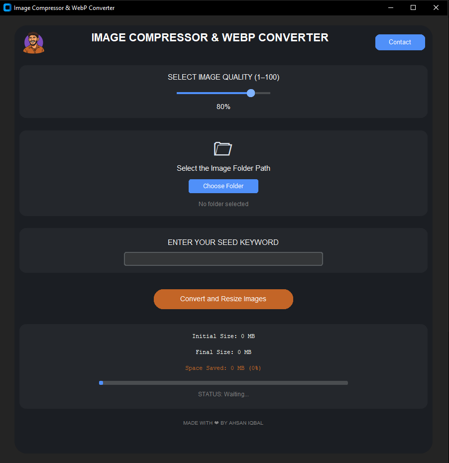

# 🖼️ Image Compressor & WebP Converter


---

## 👨‍💻 About Me

Hi, I’m **Muhammad Ahsan Iqbal**, a Digital Marketing Instructor & SEO Consultant with a passion for building automation tools that look as good as they perform.  
This tool is part of my initiative to create accessible, beautiful, and efficient utilities for content creators and web developers.  
🔗 [Visit My Portfolio](https://muhammadahsaniqbal.com) | 💼 [Connect on LinkedIn](https://www.linkedin.com/in/ahsan-iqbal-digitalmarketingexpert/)

---

## ✨ Overview

A modern, high-performance GUI app to **compress and convert images to `.webp`** format in bulk.  
It offers a clean dark UI, custom quality slider, live status updates, and keyword-based file renaming. Perfect for bloggers, designers, Pinterest creators, and SEOs.



---

## 🚀 Features

- 🎨 Sleek dark-mode interface (CustomTkinter)
- 📂 Bulk folder-based conversion
- 🔠 Keyword-based image renaming (`travel-001.webp`)
- 📉 Smart compression with quality control slider
- 📊 Real-time progress bar, space saved, and stats
- 🧠 Optimized for 1920x1080 resolution
- ✅ Works offline — fully local desktop app!

---

## 📦 Installation

```bash
git clone https://github.com/your-username/image-compressor-webp.git
cd image-compressor-webp
pip install -r requirements.txt
python main.py
